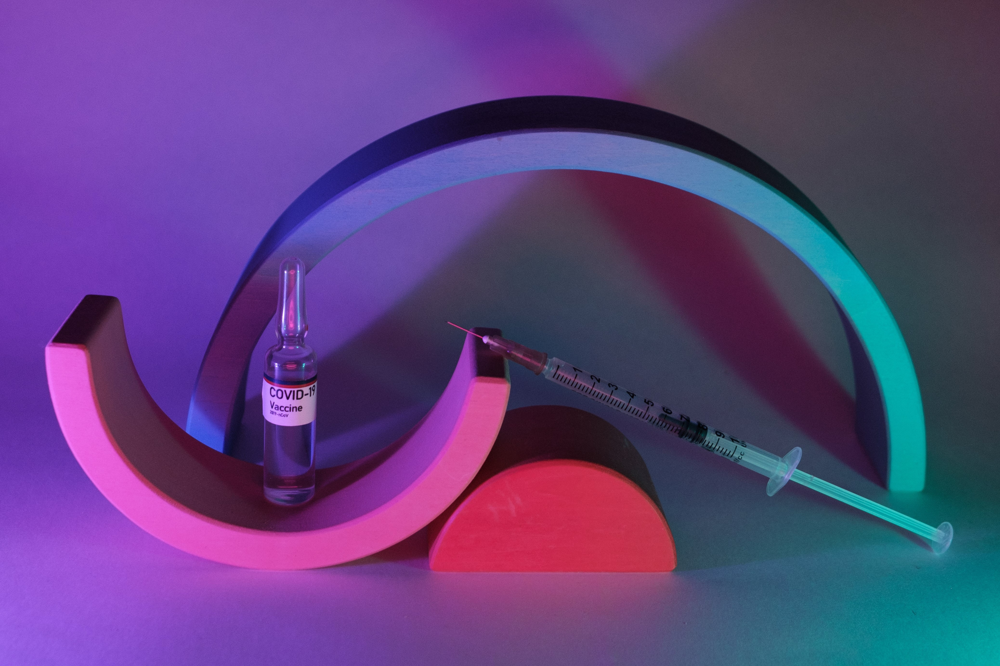

---
October 2 the day of initiation: I opened the CoWIN website to look for Covishield slots. My brother told me before that it would take me weeks to get a slot; I had to look at it everyday for hours to understand how slots were released. and then login at the right time to get an available slot. I am not a big fan of manual labor because using my hands to do any kind of mundane repetitive tasks would potentially break my beautiful nails so that was out of the question. there was only one thing left for me... programming a bot to do my work.

Now excuse me, as I have another CTF I need to to attend to. Auth0.