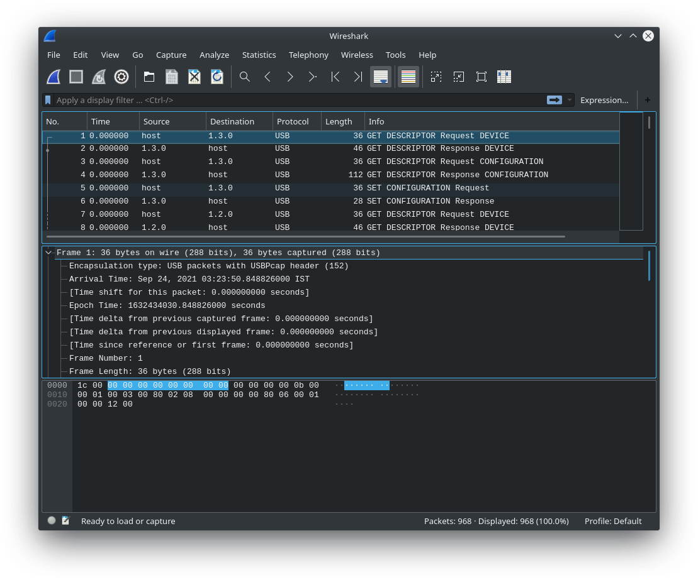
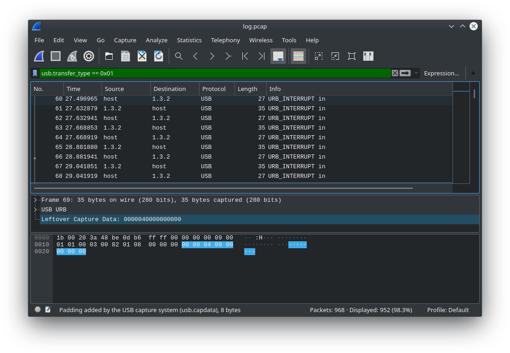
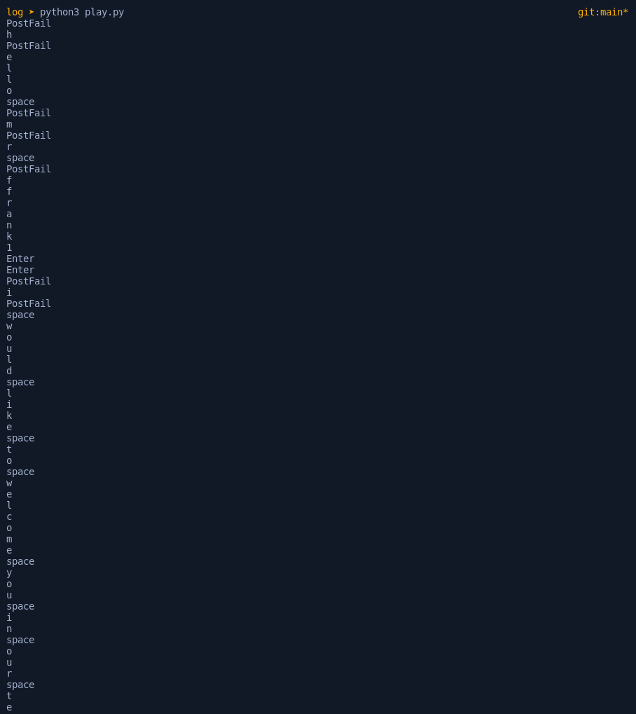

---

Auth0 CTF was another great experience for me to attempt all kinds of new challenges. I could only solve 6 challenges with just 1 Web this time(). Among Forensics was a challenege called `Log`, which gave me log.pcap file and hinted it records a transfer between USB device and the host. 

> if you dont know PCAP : a packet capture file consisting of captured network traffic 



opened the file with wireshark packet and noticed a new kind of communication, to be honest i did know this was possible until i understood what was happening...

1. the source and destination using object IDs for communication, something i gathered when reading about SNMP
2. protocol USB(Universal Serial Bus) 

it's apparent i'm not dealing with any 802.x traffic

after few minutes of research i confirm that it's a USB traffic capture data. and then it hit me, everything inside a device is also networks, a mesh of paths between different components that talk to each other and make the computer work. i browse around to see what kind of information in the Packet details. this seems to contain few different devices. i saw what i thought are remains of a video file transfer, and thought the flag might be present in one of the frames, so i spent a major amount of time extracting those. no luck since i couldn't find anything on how to do it. 

but [i found 3 years old CTF write-up which was about reverse engineering USB keystrokes](https://abawazeeer.medium.com/kaizen-ctf-2018-reverse-engineer-usb-keystrok-from-pcap-file-2412351679f4), also from PCAP files, and thought maybe this is what happening here. quickly read through the article and saw that my pcap file had a lot of keyboard interrupts to as well(i just chose to ignore them at first) and read up on USB specifications [here](https://www.beyondlogic.org/usbnutshell/usb4.shtml#Interrupt).


Interrupts happen whenever you press a key or click a button, anything that "interrupts" the CPU after which it has to process your input. Each `URB_INTERRUPT in` in the file corresponds to a key pressed and the Leftover Capture Data field shows the hex value of the key in 8 byte format.

creating a filter to list all interrupt communication with non-empty 8 bytes 

`usb.transfer_type == 0x01`



`usb.transfer_type == 0x01 && usb.dst == "host" && !(usb.capdata == 00:00:00:00:00:00:00:00)`


crafting a tshark command to get the leftover capture data for the above filters and redirect into a text file

```bash
tshark -r log.pcap -Tfields -Eseparator=, -e usb.capdata -Y 'usb.transfer_type == 0x01 && usb.dst == "host" && !(usb.capdata == 00:00:00:00:00:00:00:00)' | sed 's/://g' > usb.capdata
```


```python
keyboard = {
    2: "PostFail",    4: "a",    5: "b",    6: "c",    7: "d",    8: "e",    9: "f",    10: "g",    11: "h",    12: "i",    13: "j",    14: "k",    15: "l",    16: "m",    17: "n",    18: "o",    19: "p",    20: "q",    21: "r",    22: "s",    23: "t",    24: "u",    25: "v",    26: "w",    27: "x",    28: "y",    29: "z",    30: "1",    31: "2",    32: "3",    33: "4",    34: "5",    35: "6",    36: "7",    37: "8",    38: "9",    39: "0",    40: "Enter",    41: "esc",    2: "del",    43: "tab",    44: "space",    45: "-",    47: "[",    48: "]",    51: "DownArrow",    54: "1",    55: "*",    56: "/",    57: "CapsLock",    79: "RightArrow",    80: "LeftArrow"
}

with open("usb.capdata") as file:
    i = 1
    for line in file:
        bytesArray = bytearray.fromhex(line.strip())
        for byte in bytesArray:
            if byte != 0:
                keyVal = int(byte)

        if keyVal in keyboard:
            print(keyboard[keyVal])
        else:
            print("no map found for this value: " + str(keyVal))

    i += 1
```



decoding the non-printable characters, and formatting the output to make it more readable and the message reads

